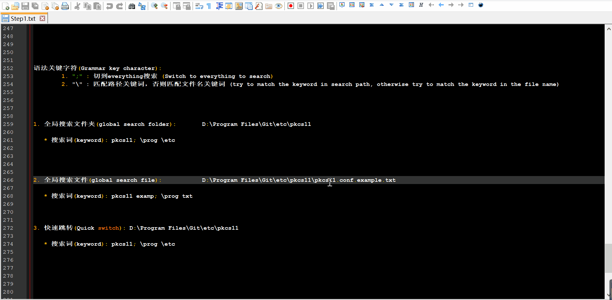

# FolderJump v1.02

这是一款帮你解决日常"最近"问题的办公效率工具（付费/免费）：

This is an office efficiency tool that helps you solve your daily "recent" problems (Pay/Free):

- 权限：免安装（绿色版）、无联网、免管理员权限、不搜集用户隐私信息。

  Permissions: No installation required (Portable), no Internet connection, no administrator privileges, no collection of user privacy information.

- 简洁漂亮的用户界面。

  Simple and beautiful program UI.

- 快速打开最近访问过的文件夹和文件、合并文件夹、复制路径、快速搜索。

  Quickly open recently visited folders and files, merge folders, copy paths, and quick search for files/folders.

- "保存"、"另存为" 等各类对话框的文件夹快速跳转。

  Quick swtich to folders in various dialog boxes such as "Save" and "Save As".

- 窗口增强：置顶、移动、调整大小、最大化、重命名、同类窗口切换。

  Window Enhancements: Pin, Move, Resize, Maximize, Rename, Windows switch between the same program.

- 资源管理器增强：跳转树快捷导航。

  Resource Manager Enhancement: Quick navigation through JumpTree.

- 结合Everything 进行全局搜索。

  Global search in combination with Everything.

# 系统环境 (System)

- Win10、Win11
- Explorer、Explorer+QtTabBar、XYplorer
- Language: 中文、English

# 软件界面 (Program UI)

# 软件功能 (Program Feature)

下面的演示中我是使用第三方的鼠标手势触发FolderJump弹出界面的快捷键。

In the following demonstration, a third-party mouse gesture is used to trigger the shortcut key for the FolderJump pop-up interface

## 1. 近期记录 (Recent History)

- 自动记录打开过的文件夹

  Auto record the opened folder

- 自动记录打开过的文件

  Auto record the opened file

- 搜索历史记录: 在全路径中进行关键词匹配

  Search folder/file history: match keyword in full path.

- 滚动时自动显示路径

  Auto show path when wheel up/down

- 鼠标悬停时显示路径

  Auto show path which is under the cursor

- 点击'[+]'翻页

  Click '[+]' to the next page

- 右击'[+]'回到主页

  Right Click '[+]' back to Home page

- 双击打开路径

  Double click to open path

- 复制路径: 按下'c'

  Copy path: press 'c'

- 删除路径：按下'd'

  Delete path：press 'd'

- 多选模式：按下 'RAlt'，再进行复制、删除、打开...

  Mulitple selection mode: press 'RAlt', then you can: copy, delete, open ...

- 路径置顶或取消：鼠标中键

  Toggle item always-on-top: MButton

- 主面板置顶或取消：鼠标中键点击logo图标

  Toggle main panel always-on-top: MButton on logo icon

- 主面板和收藏夹切换：单击logo图标

  Toggle main panel and favoriate panel: click logo icon

- 路径加入到收藏夹：按下 'a'

  Add item to favoriate panel: press 'a'

- 收藏夹下的路径删除：按下 'd'

  Delete item from favoriate panel: press 'd'

- 路径分组：一个分组可包含多个路径。最多可设置3个分组: 按下 'g'

  Folder Group: contains multiple path. Up to 3 groups are supported : press 'g'

- 展开当前目录：平铺或文件树：右键。

  Expand target folder: Flat or Tree View. Use Right Button

- 粘贴文件到文件夹内: ctrl+v或拖拽

  Paste file to the folder: ctrl+v or drag

- 双击条目：打开对应文件

  Double click: open the file

- 右击条目：打开对应文件所有在的文件夹

  Right click: open the folder where this file is

- 搜索历史记录: 在全路径中进行关键词匹配

  Search folder/file history: match keyword in full path

- 从列表中清除不存在的文件: 无效文件图标的显示为红色的'x'

  Remove non-existent files from the list: which icon is displayed as a red 'X'

- 复制路径: 按下'c'

  Copy path: press 'c'

- 删除路径：按下'd'

  Delete path：press 'd'

- 复制文件: 按下'ctrl+c'

  Copy file: press 'ctrl+c'

- 导入文件到列表中：ctrl+v或拖拽

  Add item to the list: ctrl+v or drag

- 打开文件或文件夹：双击。

  Open file or folder: Double click

- 复制路径：按下'c'

  Copy path: press 'c'

- 复制文件：按下'ctrl+c'

  Copy file: press 'ctrl+c'

- 粘贴文件到父目录：按下'ctrl+v'

  Paste file to parent folder: press 'ctrl+v'

- 文件树也支持上面这些操作，不做演示。

  The file tree supports the above operations too, I don't show that again...

  

- 搜索：在全路径中进行关键词匹配，显示匹配的文件、文件夹（保留目录层次结构、高亮自己）

  Search: match keyword in full path, Display matching files and folders (keep the directory structure and highlight itself

- 合并文件夹:  按下'm'。提取所有文件到当前目录，删除空文件夹。

  Merge folders: press 'm'. Move all files from sub folders to the current folder, then delete empty sub folders

- 强制覆盖文件: 按下'o'。任何拖入/粘贴到目录的文件都会被强制替换成目标文件。

  Forced overwrite file: Press 'o'. Any file dragged/paste into the directory will be forcibly replaced with the target file

  > 例如：D:\Program Files\Git\sample\etc\A_ToBeOverride.png。那么任何被拖入或粘贴到 D:\Program Files\Git\sample\etc\目录的文件都会替换掉A_ToBeOverride.png。
  >
> (For example: D:\Program Files\Git\sample\etc\A_ToBeOverride.png. Then any file dragged/paste into the D:\Program Files\Git\sample\etc\ directory will replace A_ToBeOverride.png)

  

## 2. 快速切换 (Quick Switch)

- 自动吸附目标窗口，最近一次访问的文件夹用 '红圈+打勾' 表示。

  Automatically tracking the target window. The folder of the last visit is indicated by a 'red circle + checkmark'

- 快捷键'Alt'：导入最近一次访问的路径

  Shortcut Key 'Alt' : Switch to the path of the last visit

- 支持所有历史条目，支持搜索结果

  supports all history items and search results

- 如果使用了平铺或文件树窗口：选中文件时自动转换为所在目录的路径。

  For flat or tree View: If a file is selected, it will be converted to the path of the directory where it is located

## 3. 跳转树 (Jump Tree)

显示正打开的文件夹、它们之间的层次关系。

Display the currently open folders and the hierarchical relationships among them

- 使用资源管理器时会自动弹出；不使用时自动隐藏。

  It will pop up automatically when using the Resource Manager.Automatically hide when not in use)

- 高亮图标：当前所在的窗口。

  Highlight: The current window.

- 单击图标：跳转到对应的文件夹。

  Click the icon: Jump to the corresponding folder.

- 图标1：显示或隐藏窗口。

  Icon1: Show or hide the window

- 图标2：合并所有窗口：(仅支持Qttabbar)

  Icon2: Merge All Windows: (Only supports Qttabbar)

- 右击图标：关闭对应的文件夹。

  Right-click the icon: Close the corresponding folder

- 图标3：关闭其它窗口。

  Icon3: Close other Windows

- 图标4：关闭所有窗口。

  Icon4: Close all Windows.

- 主界面显示跳转树

  Main panel shows JumpTree and go to it

## 4. 窗口增强 (Window Enhance)

- 选中某个文件夹 --> 按下'Tab': 展开选中的文件夹

  Select a folder --> press 'Tab': Expand the selected folder tree

- 未选中任何文件夹 --> 按下Tab: 展开当前整个目录

  Not select any folder --> press 'Tab': Expand current directory tree

- 单击Esc正下方那个按键: 从前一级开始展开目录

  Press the key under Esc: Expand the parent-parent folder tree

- 双击Esc正下方那个按键 : 从前二级开始展开目录

  Double Press the key under Esc: Expand the parent-parent folder tree

  

> Caps 指的是大写锁定键，即字母A左边那个CapsLock按键。
>  ("Caps" refers to the uppercase lock key, which is at the left of the letter "A")

- Caps + 左键拖动：移动目标窗口。

  Caps + Left Button drag: Move the window

- Caps + 右键拖动：调整目标窗口大小。

  Caps + Right Button and drag: Resize the window

- Caps + 左键双击：对窗口进行置顶或取消置顶目。（或快捷Ctrl + T）

  Caps + Double click: Toggle window always-on-top. (Or the shortcut Ctrl + T

- Caps + 中键：对窗口最大化或恢复大小。

  Caps + Middle Button: Maximize or restore the window size

- 窗口切换：在同类程序的多个窗口之间快速切换。快捷键Ctrl+空格。

  Window switching: Quickly switch between multiple Windows of the same type of program.The shortcut key is Ctrl+ Space.

- 窗口重命名：修改窗口标题栏的名字。快捷键Ctrl+F2。

  Window renaming: Modify the name of the window title bar.Shortcut key: Ctrl+F2

## 5. 全局搜索 (Global Search)

该功能依赖于Everything的搜索引擎

This function relies on the search engine of Everything

语法关键字符(Grammar key character):
1. ";" : 切到everything搜索 (Switch to everything to search)
2. "\\" : 匹配路径关键词，否则匹配文件名关键词 (try to match the keyword in search path, otherwise try to match the keyword in the file name)

- 全局搜索文件夹(global search folder): `D:\Program Files\Git\etc\pkcs11`

  > 搜索词(keyword): pkcs11; \prog \etc

- 全局搜索文件(global search file): `D:\Program Files\Git\etc\pkcs11\pkcs11.conf.example.txt`

  > 搜索词(keyword): pkcs11 examp; \prog txt

  

- 快速跳转(Quick switch): `D:\Program Files\Git\etc\pkcs11`

  > 搜索词(keyword): pkcs11; \prog \etc

  

# 免费 (Free)

- Function limited version.

- TODO ...

# 付费 (Purchase)

- 买断制：一次购买，永久升级和使用。一个激活码仅激活一台计算机。

  Lifetime: One-time purchase for permanent upgrade and use. One License can only activate one computer

- 价格：待定。 (1个激活码大概1杯奶茶/咖啡的钱)

  Price: To be determined. (About a cup of tea/coffee per License).

- TODO ...

# 联系 (Contact)

- Email: folderjump@gmail.com
- QQ: 297010976
- QQ Group: 758125907

